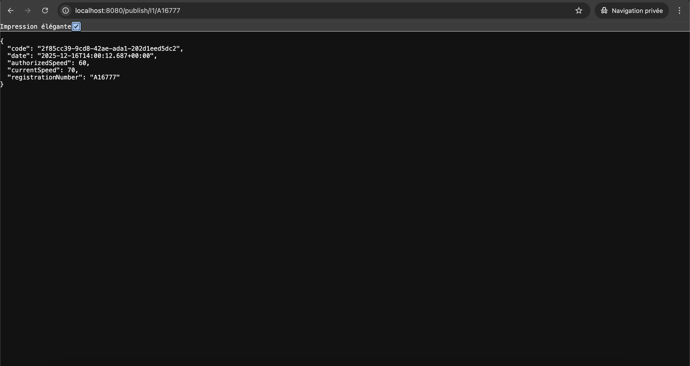
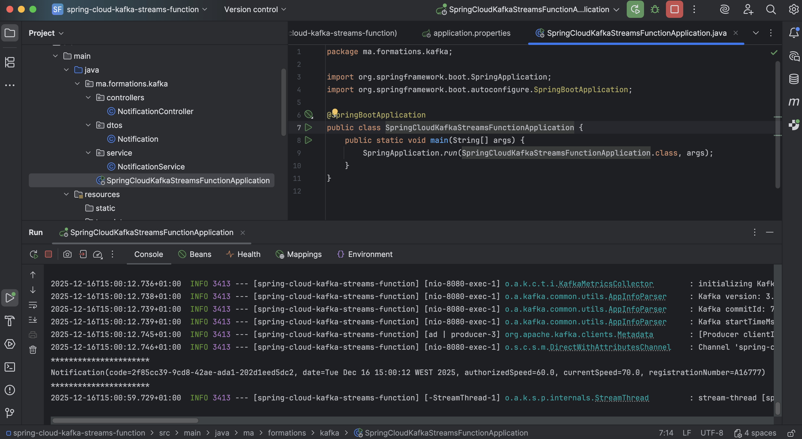
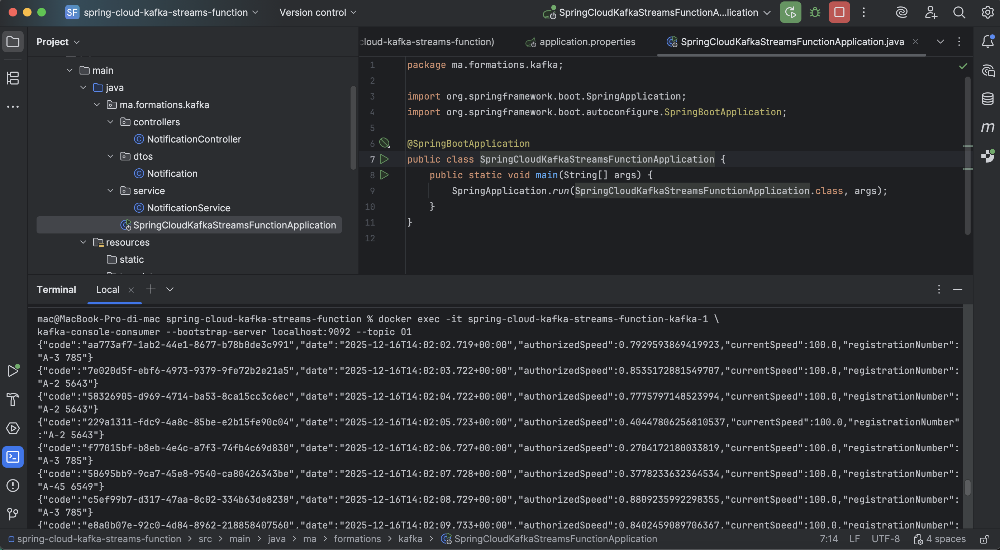
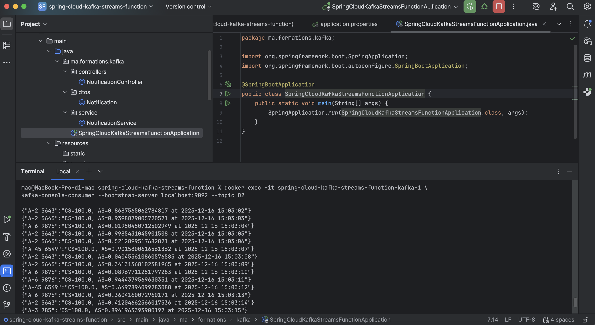
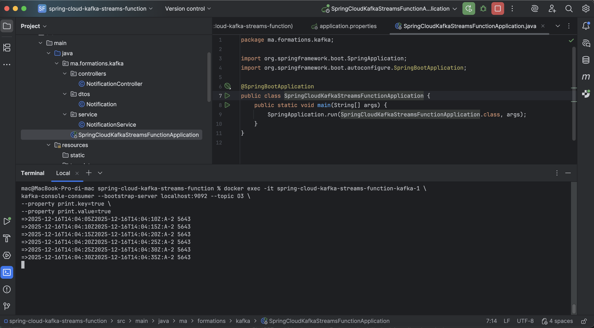
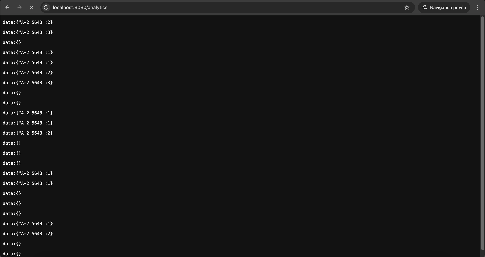

# TP 12 — Spring Cloud Stream & Kafka (Function + Kafka Streams)


Projet du **TP 12 – Introduction à Spring Cloud Stream avec Kafka**.  
Ce TP a pour objectif de **mettre en œuvre une architecture événementielle** basée sur **Apache Kafka**, en utilisant le **modèle fonctionnel de Spring Cloud Stream** ainsi que **Kafka Streams** pour l’analyse temps réel.

---

## 📌 Sommaire

1. [Objectifs du TP](#-objectifs-du-tp)
2. [Concepts clés](#-concepts-clés)
3. [Stack technique](#-stack-technique)
4. [Architecture du projet](#-architecture-du-projet)
5. [Fonctions implémentées](#-fonctions-implémentées)
6. [Broker Kafka](#-broker-kafka)
7. [Démarrage rapide](#-démarrage-rapide)
8. [Tests & démonstrations](#-tests--démonstrations)
9. [Auteurs](#-auteurs)
10. [Licence](#-licence)

---

## 🎯 Objectifs du TP

- Comprendre l’architecture **Event-Driven**
- Mettre en œuvre **Spring Cloud Stream (Function Model)**
- Utiliser **Apache Kafka** comme broker de messages
- Implémenter :
    - **Producer**
    - **Consumer**
    - **Function (Processor)**
    - **Kafka Streams (KStream, Windowing, Aggregation)**
- Tester la communication via **topics Kafka**
- Exploiter **Interactive Queries** pour l’analytics temps réel

---

## 🧠 Concepts clés

### 🔹 Spring Cloud Stream (Function Model)
- Basé sur `Supplier`, `Consumer`, `Function`
- Découplage total entre le code métier et le broker
- Configuration par **bindings**

### 🔹 Apache Kafka
- Broker de messages distribué
- Communication **asynchrone** et **scalable**
- Utilisation de **topics** comme canaux d’échange

### 🔹 Kafka Streams
- Traitement temps réel des flux
- Filtrage, agrégation, windowing
- Stockage local avec **State Stores**

---

## 🛠️ Stack technique

| Technologie | Version |
|------------|---------|
| Java | 17 |
| Spring Boot | 3.x |
| Spring Cloud Stream | 2024.x |
| Apache Kafka | 7.6.1 (Confluent) |
| Kafka Streams | ✅ |
| Docker / Docker Compose | ✅ |
| Maven | ✅ |
| IntelliJ IDEA | Ultimate |
| OS | macOS |

---

## 🏗️ Architecture du projet
```
spring-cloud-kafka-streams-function/
├── docker-compose.yml
├── pom.xml
├── src/main/java/ma/formations/kafka/
│ ├── SpringCloudKafkaStreamsFunctionApplication.java
│ ├── controllers/
│ │ └── NotificationController.java
│ ├── dtos/
│ │ └── Notification.java
│ └── service/
│ └── NotificationService.java
│
├── src/main/resources/
│ └── application.properties
│
└── README.md
```


---

## 🧩 Fonctions implémentées

| Fonction | Type | Description | Topic |
|-------|------|------------|-------|
| notificationSupplier | Supplier | Génère des notifications automatiquement | O1 |
| notificationConsumer | Consumer | Consomme et affiche les messages | I1 |
| notificationFunction | Function | Transforme Notification → Map | O1 → O2 |
| kStreamFunction | Kafka Streams | Filtrage + comptage par fenêtre | O1 → O3 |

---

## 🧱 Broker Kafka

- **Image Docker** : `confluentinc/cp-kafka:7.6.1`
- **Zookeeper** : `confluentinc/cp-zookeeper:7.6.1`
- **Bootstrap server** : `localhost:9092`

### Topics utilisés
- `I1` : input (HTTP → Kafka)
- `O1` : output du Supplier
- `O2` : output de la Function
- `O3` : output Kafka Streams (analytics)

---

## 🚀 Démarrage rapide

### 1️⃣ Prérequis

✅ Java **17**  
✅ Docker & Docker Compose  
✅ Maven  
✅ IntelliJ IDEA  
✅ Git


### 2️⃣ Lancer Kafka (Docker)

```
docker compose up -d
```
Vérification : <br/>
```
docker ps
```

### 3️⃣ Créer les topics Kafka

```
docker exec -it spring-cloud-kafka-streams-function-kafka-1 \
kafka-topics --bootstrap-server localhost:9092 --create --topic I1 --partitions 1 --replication-factor 1

docker exec -it spring-cloud-kafka-streams-function-kafka-1 \
kafka-topics --bootstrap-server localhost:9092 --create --topic O1 --partitions 1 --replication-factor 1

docker exec -it spring-cloud-kafka-streams-function-kafka-1 \
kafka-topics --bootstrap-server localhost:9092 --create --topic O2 --partitions 1 --replication-factor 1

docker exec -it spring-cloud-kafka-streams-function-kafka-1 \
kafka-topics --bootstrap-server localhost:9092 --create --topic O3 --partitions 1 --replication-factor 1
```

### 4️⃣ Lancer l’application Spring Boot

Depuis IntelliJ : <br/>

```
SpringCloudKafkaStreamsFunctionApplication
```

---


## 🔗 Tests & démonstrations

### 🔹 Test 1 — HTTP Producer → Kafka (I1) <br/>

_**Sur le navigateur :**_

#### 👉 http://localhost:8080/publish/I1/A16777 <br/>

|              Test 1               |
|-----------------------------------|
|     |

#### ➡️ Message publié + consommé par notificationConsumer <br/>

### 🔹 Test 2 — Supplier automatique (O1) <br/>
```
docker exec -it spring-cloud-kafka-streams-function-kafka-1 \
kafka-console-consumer --bootstrap-server localhost:9092 --topic O1
```

| Test 2          |
|-----------------|
|  |


#### ➡️ Génération automatique de messages toutes les secondes <br/>

### 🔹 Test 3 — Function (O1 → O2) <br/>

```
docker exec -it spring-cloud-kafka-streams-function-kafka-1 \
kafka-console-consumer --bootstrap-server localhost:9092 --topic O2
```

| Test 3          |
|-----------------|
|  |

#### ➡️ Messages transformés (Map) <br/>

### 🔹 Test 4 — Kafka Streams Analytics (O3) <br/>

```
docker exec -it spring-cloud-kafka-streams-function-kafka-1 \
kafka-console-consumer --bootstrap-server localhost:9092 --topic O3 \
--property print.key=true \
--property print.value=true
```

| Test 4          |
|-----------------|
|  |

#### ➡️ Comptage par fenêtre pour A-2 5643 <br/>

### 🔹 Test 5 — Endpoint Analytics (SSE) <br/>

**_Sur le navigateur :_**

#### 👉 http://localhost:8080/analytics <br/>


| Test 5          |
|-----------------|
|  |

#### ➡️ Flux temps réel avec comptage dynamique <br/>

---

## 👥 Auteurs

Anas KRIR & Adam EL YOURI <br/>
Étudiants Ingénieurs — MIAGE <br/>
TP réalisé dans le cadre du module J2EE / Middleware <br/>

Spring Boot · Spring Cloud Stream · Apache Kafka · Kafka Streams · Event-Driven Architecture <br/>

---

## 📄 Licence

✅ Projet sous licence MIT <br/>
Libre d’utilisation, modification et distribution à des fins pédagogiques. <br/>

© 2025 — Anas KRIR & Adam EL YOURI

---


